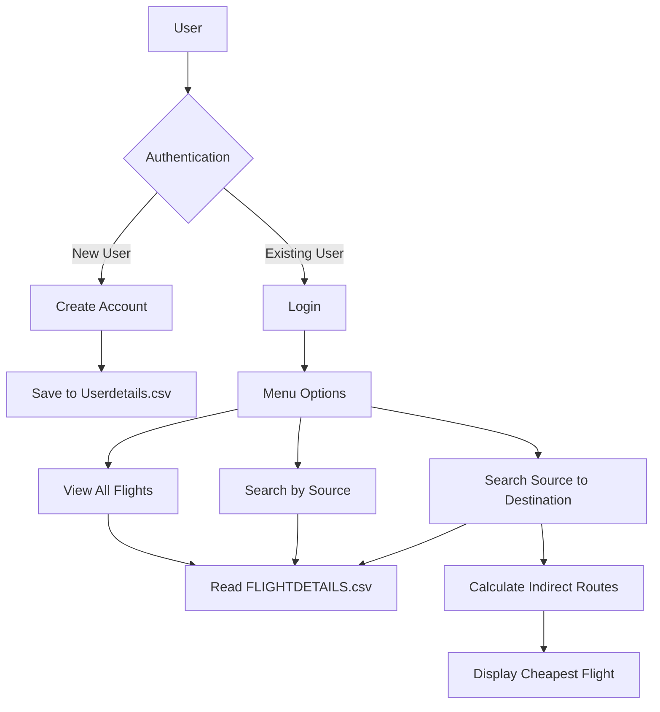
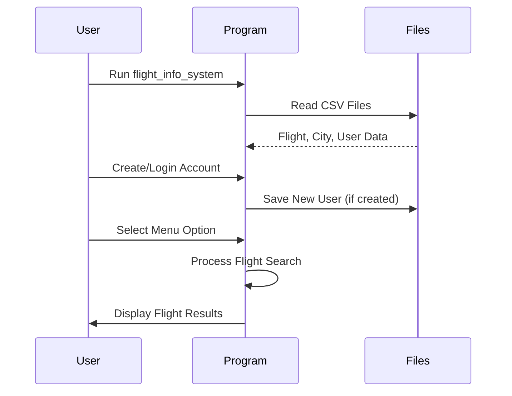

# Flight Information System

[](https://en.wikipedia.org/wiki/C_(programming_language))
[](https://github.com/Rakshak-D/Flightmanagement/issues)
[](LICENSE)

A C-based Flight Information System for managing flight details, user accounts, and searching flights, including direct and indirect routes with the cheapest indirect flight option.


---

## ✨ Key Features

### ✈️ Flight Management
- Displays all available flights with details (Flight ID, Source, Destination, Times, Fare).
- Searches flights from a specific source city.
- Finds direct and indirect flights between source and destination, including total fare and time.
- Identifies the cheapest indirect flight with optimized calculation.

### 👤 User Management
- Supports user account creation with robust validation for username, email, and password.
- Provides secure login with username/email and password, limiting attempts for security.
- Stores user data in a CSV file with sanitization to prevent formatting issues.

### 📍 City Management
- Maintains a list of cities loaded from a CSV file.
- Allows users to select source and destination cities with improved input handling.

### 📄 Data Handling
- Reads flight details, city lists, and user data from CSV files (`FLIGHTDETAILS.csv`, `PLACES.csv`, `Userdetails.csv`).
- Creates empty CSV files if they don’t exist, with robust error handling.
- Validates input data to prevent buffer overflows and CSV parsing issues.

### 🛠️ User Interface
- Interactive console menu for selecting options (view all flights, search by source, search source-to-destination, logout).
- Formatted output with tables for flight details and clear, user-friendly prompts.

---

## 🚀 Quick Start

### Prerequisites
- C compiler (e.g., GCC)
- Standard C libraries (`stdio.h`, `stdlib.h`, `string.h`, `ctype.h`)
- Write permissions in the working directory

### Setup Instructions
```bash
# Clone repository
git clone https://github.com/Rakshak-D/Flightmanagement.git
cd Flightmanagement

# Compile the C program
gcc flight_info_system.c -o flight_info_system

# Run the program
./flight_info_system
```

**Input Requirements:**
- Prepare the following CSV files in the project root (created automatically if missing):
  - `FLIGHTDETAILS.csv` (format: `FlightID,Source,ArrivalTime,Destination,DepartureTime,FlightTime,Fare`):
    ```
    F001,New York,08:00,London,12:00,4.0,500.00
    F002,London,13:00,Paris,14:30,1.5,150.00
    ```
  - `PLACES.csv` (format: `City`):
    ```
    New York
    London
    Paris
    ```
  - `Userdetails.csv` (format: `Username,Email,Password`):
    ```
    john_doe,john@example.com,password123
    ```
- Run the program, create/login to a user account, and select options to search flights.

**Example Run:**
```bash
------------------------------------------------------------
Welcome to Flight Finder
Do you have a travel account with us? [Y/N] N
------------------------------------------------------------
Let's create your new account :)
Enter Your Username: alice
Enter your Email Address: alice@example.com
Enter your Password: securepass123
Account created successfully!
------------------------------------------------------------
Welcome!! alice
How may I help you
Select an option:
1. Check all flights available
2. Check flights from one place
3. Check flights from one place to another
4. Logout
```

---

## 🌐 Project Overview

### System Diagram


### Execution Flow


---

## 🛠 Technology Stack

| Component       | Technologies                                |
|-----------------|--------------------------------------------|
| **Programming** | C (Standard Library)                       |
| **Data Input**  | CSV File Parsing                           |
| **Functionality**| Flight Search, User Authentication         |
| **Dependencies**| stdio.h, stdlib.h, string.h, ctype.h       |

---

## 📂 Repository Structure

```
Flightmanagement/
├── flight_info_system.c       # Main C program
├── FLIGHTDETAILS.csv          # Flight data 
├── PLACES.csv                 # City list 
├── Userdetails.csv            # User data 
├── README.md                  # Project documentation
├── LICENSE                    # MIT License
└── .gitignore                 # Git ignore file
```

---

## 📝 Core Dependencies

- Standard C libraries (included with any C compiler):
  - `stdio.h` (file I/O and console output)
  - `stdlib.h` (memory management)
  - `string.h` (string operations)
  - `ctype.h` (character handling)

No external libraries required.

---

## 🐛 Issue Reporting

[](https://github.com/Rakshak-D/Flightmanagement/issues)

**Bug Report Template:**
```markdown
## Description
[Describe the issue clearly]

## Reproduction Steps
1. Run program...
2. Input credentials/options...
3. Observe...

**Expected Behavior**
[What should happen]

**Actual Behavior**
[What actually happens]

**Environment**
- OS: [e.g., Windows 11]
- Compiler: [e.g., GCC 11.4]
- Input Files: [e.g., CSV contents]

**Additional Context**
[Screenshots, error messages]
```

**Issue Labels**
- `bug` - Code or output errors
- `enhancement` - New feature requests
- `documentation` - README or comment improvements

---

## 📜 License

This project is licensed under the MIT License - see [LICENSE](LICENSE) for details.

---

## 📬 Contact & Support

**Project Maintainer**  
Rakshak D  
📧 rakshakmce@gmail.com  
🔗 [GitHub Profile](https://github.com/Rakshak-D)

---

## 🛠️ Development Roadmap

### Next Milestones
- Add flight booking functionality
- Support time-based filtering for flights
- Implement sorting of flights by fare or time
- Enhance CSV parsing for robustness

### Contribution Guide
1. Fork the repository.
2. Create a feature branch (`git checkout -b feature/new-functionality`).
3. Commit changes (`git commit -m 'Add new functionality'`).
4. Push to branch (`git push origin feature/new-functionality`).
5. Open a Pull Request.

**Code Standards**
- Follow ANSI C conventions.
- Include clear comments for functions and logic.
- Ensure portability across compilers.
- Test with sample CSV files.

---

